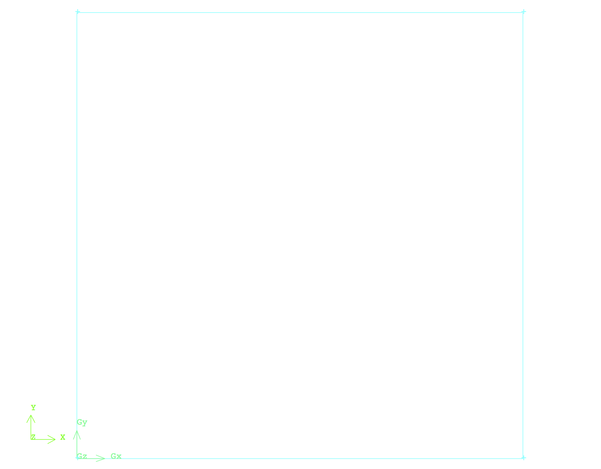
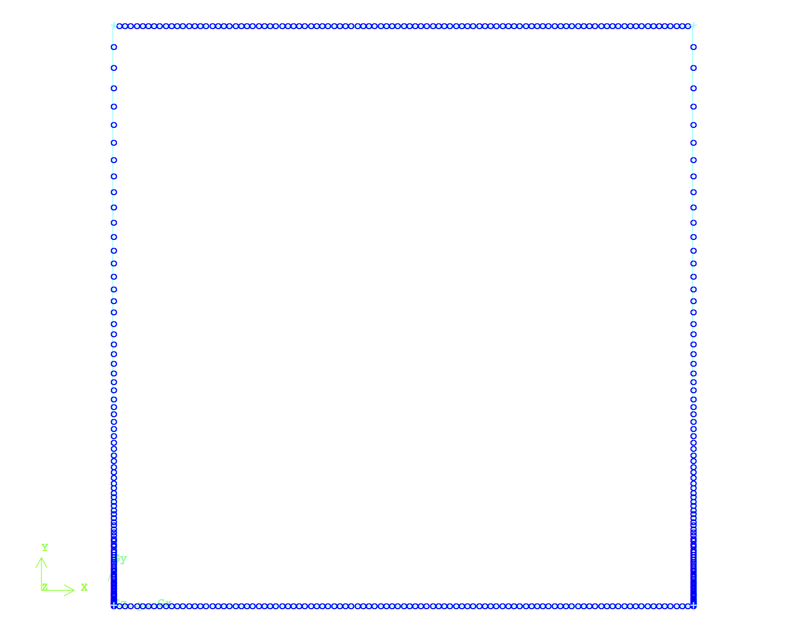
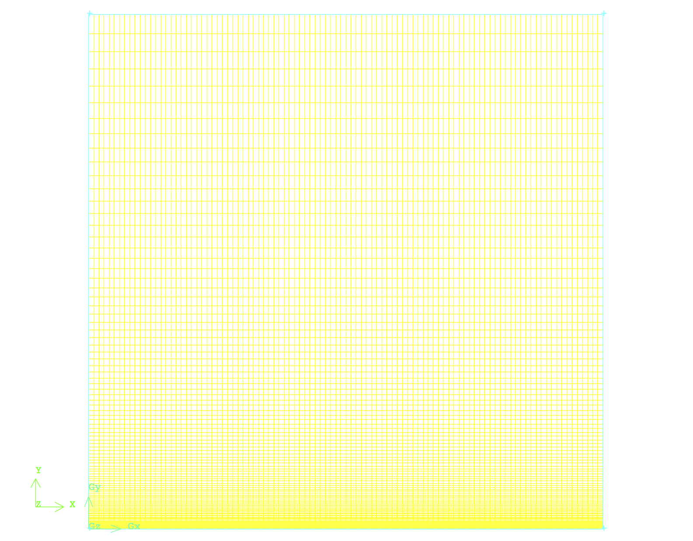

# CFD Domain's Creation & Discretization

**After the review of physics and theory behind the problem of interest, to simulate and study the flow field first a CFD/Computational domain should be created. This CFD domain is discretized into small finite elements (2D) or finite volumes (3D). The flow field's governing equations are then solved numerically inside these elements or volumes via an iterative process till a converged solution inside the CFD domain is obtained. This section explains the process of creation and discretization of CFD domain for the problem of interest.**

The CFD domain for the 2D laminar flow over a flat plate is a finite two dimensional square with side of 1 [m] as shown in Fig.1. The shape and dimension of the domain is chosen such that the number of mesh elements are under control and non-dimensional group of variables can be estimated easier. The users should define the dimensions of the CFD domain according to their problem definition.

 
Fig.1 - The CFD domain for the two dimensional laminar flow over a flat plate.

To create the geometry of the visualized CFD domain in Fig.1, it is recommended to start with four points spaced equally with distance of 1 [m] with respect to each other and then connect them together and define a unit surface. These steps might need to be implemented slightly different according to the used CAD/mesher software of choice.

After the CFD domain is created, it should be discretized into finite elements (a.k.a meshing). Technically, meshing is the process of "chopping" it into small finite elements and/or volumes, wherein the flow field's governing equations will be solved numerically. High quality mesh elements lead to a smoother and more promising numerical solution. Therefore, it is important to increase the level of controllability on the raw geometry from the first step by proper meshing and topology techniques. For example in this problem to increase the level of controllability on the meshing process, the vertical edges of the CFD domain are discretized into same mesh element using a pre-difned mesh element distribution as shown in Fig.2.

 
Fig.2 - Controlling mesh element distribution along the vertical edges of the CFD domain.

This provides the contoroability of the user on the reolution of the mesh to capture the complex flow field behaviour close to the flat plate region (boundary layer). Although to study the laminar boundary layer high mesh resolution is not significantly required, however if users want to expand the application of the current simulation for study of the turbulent boundary layer using this meshing technique will make potential futhure modification easy and straight forward. Furthermore, this technique would provide the ability to have less number of mesh element outside of the boundary layer, where the flow is uniform in the streamwise direction.

In the next step the horizontal edges of the CFD domain will be meshed using a uniform distribution of mesh elements along them as it is visualized in Fig.3. It should be noted that if required the users can use specific mesh element distribution to increase or decrease the mesh resolution at the inlet, middle or outlet of the domain. For the current problem of the interst that is not necessary.

 
Fig.3 - Mesh procedure of the horizontal edges of the CFD domain.

Finally the two dimensional CFD domain can be meshed using the proper meshing algorithm of choice. Fig. 4 visualizes the outcome of this meshing progress.

 
Fig.4 - Finalized mesh of the CFD domain.

As shown in Fig.4 the mesh resolution is higher close to the boundary of the flat plat and it decreases moving up toward the top part of the CFD domain.

One the mesh is generated it's quality should be examined. This can be done using the provided features and functions defined in the meshing software. In general these functions calculate the aspect ratio of each elements and report a statistical report on them. The goal is to keep the average aspect ratio close to 1 for a very high quality mesh. In this stage the CFD domain is completely meshed and is ready to be setup for a CFD simulation.

<More explanations can be added here on the concept of mesh examination.>

> The complete mesh file (.msh) can be downloaded here [Download Mesh Here!](link)
