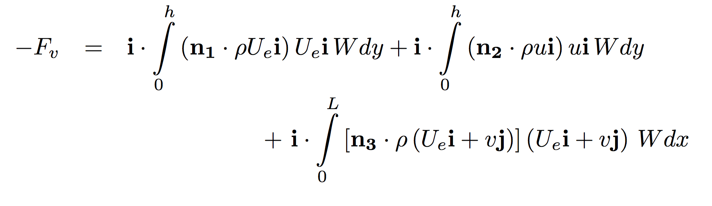

# CFD Problem's Physics & Theory

**In developing CFD simulation for a fluid mechanic problem understanding the general physics and fundamental theory of problem is extremely important. This knowledge would provide the foundation for implementation and validation of the CFD simulation. Understanding the physics and theory of the problem would provide the ability to make decision for the CFD domain, boundary conditions, numerical models and general form of expected results.**

**Understanding physics and theory of problem before developing a CFD simulation can be thought of turning on a flash light before entering a completely dark room. Hence, let's review the fundamental physics and theory behind the problem of "2D Laminar Flow in over a flat plate.":**

Figure XYZ visualizes the physics of a uniform flow passing over a flat plate. Upon the start of interaction between the fluid and solid plate, fluid elements on top of the plate will brought to stop due to the "no slip" boundary condition. As the flow moves along the plate the decelerated fluid elements decelerate the motion of neighboring fluid elements due to the viscous effect within the flow. The result of these fluid-solid and viscous interactions is the formation of a layer close to the fluid-solid common boundary called "boundary layer".

According to the flow regime (i.e. Reynolds number) the boundary layer can be either "Laminar" or "Turbulent". In both cases the flow field behavior inside the boundary layer is complex and not possible to be modeled analytically. Hence, experimental and computational techniques are used to fully analyze and understand the flow field and existing viscous forces inside the boundary layer.

Using Control Volume (CV) analysis approach for the control volume "abcd" shown in figure XYZ one can obtain a general functionality between the velocity field and viscous forces for the 2D laminar flow over a flat plate. General form of conservation of mass states:

Assuming a steady and incompressible flow the first term in the above equation becomes zero. Expanding the mass flux integral terms (i.e. second term) in the above equation on four control surfaces of the CV gives:

where n1, n2 and n3 are normal unit vectors to surfaces "ab", "cd" and "bc" respectively. Performing the dot product between normal and velocity vectors to define the flux direction and considering a unit depth for the flat plate, according the 2D assumption, the above equation will be reduced to:

where Ue is the undisturbed free stream velocity, u is the disturbed streamwise velocity and v is the normal velocity component to the streamwise direction. In this equation both u and v are unknowns and can't be calculated. To obtain a second equation one can consider the conservation of momentum in streamwise direction. The general form of conservation of momentum equation states:

Assuming that there is no external force exerted on the CV, neglecting effect of body forces and that the flow is steady the term one, four and five (from right) in the above equation will be equal to zero respectively. Furthermore, having a uniform flow entering the CV one can conclude the the pressure would be constant in the streamwise direction. In addition assuming that the thickness of boundary layer is small the pressure variation normal to the streamwise direction will also become almost constant. Application of the above-mentioned assumptions and expanding the momentum flux integral terms (i.e. sixth term) in the above equation on four control surfaces of the CV gives:

Similar to the conservation of mass equation in the equation n1, n2 and n3 are normal unit vectors to surfaces "ab", "cd" and "bc" respectively. Performing the dot product between normal and velocity vectors to define the flux direction and considering a unit depth (W) for the flat plate according the 2D assumption and the fact that the flow in incompressible, the above equation will be reduced to:

At this stage introduction of conservation of momentum equation added an additional unknown Fv into the existing number of unknowns! Multiplying the outcome of conservation of energy by Ue and subtracting the resultant equation from conservation of momentum equation would result into elimination of the integral term including the v component of the velocity field as follows:

This equation still includes two unknowns Fv and u, which are viscous force and velocity in the boundary layer region that it was of the original interest. As mentioned earlier to the the inherent complexity of the flow field inside the boundary layer region analytical solution can not be obtained to solve this equation.

In 1904 Ludwig Prandtl showed that for the flow in a boundary layer, it is possible to make some approximations to the full Navier-Stokes equation. The approximations are based on the observation that a boundary layer grows slowly, and therefore the streamlines within the layer are nearly parallel. In particular, the pressure across the layer is then nearly constant (these are the assumptions used for the CV analysis) and resulted in an equation called "boundary layer equation":

Later Paul Blasius, one of Prandtl’s students, showed that the boundary layer equation has a “similarity” solution (i.e. a universal solution). Using dimensional analysis and experimental techniques he first proposed that the velocity distribution was a function only of the freestream velocity Ue, the density, the viscosity μ, the distance from the wall y, and the distance
along the plate x:

This equation indicates that the material derivative of the velocity field (i.e. the summation of external forces per unit mass in a Lagrangian reference frame) is balanced with the summation of pressure, body and viscous forces per unit mass within the flow field. For the case of laminar flow in pipes, in most of the engineering applications the incoming flow into the pipe has an almost constant and uniform velocity. However, it is probable that the incoming flow velocity has some temporal fluctuations. In these cases these fluctuations should be estimated to declare the degree of steadiness of the flow. In generic cases the assumption of steady/unifrom flow or flow with minor temporal fluctuations is a reasonable assumption. Furthermore, considering a horizontal pipe flow, the effect of body forces can become negligible. Applying these two assumptions the Navier-Stokes equation will be reduced to:

Furthermore Blasius then showed that, instead of depending on two dimensionless variables, the velocity
distribution was a function of only one composite dimensionless variable eta, so that:

 where  

It should be highlighted that this is a purely experimental approximation not an analytical one. The variables u/Ue and eta are called similarity variables, which means that if the velocity distribution is plotted using these non-dimensional variables (instead of dimensional variables such as u and y), it is defined by a universal curve, for any Reynolds number and any position along the plate. This solution is shown in the following figure:

These particular similarity variables transform the boundary layer equation (a PDE) into an ODE which can be solved numerically. The solution is called the Blasius velocity profile.

At this stage the definition of the velocity field u can be inserted in the final form of the conservation of the momentum equation and the value of viscous forces exerted by the fluid on the flat plate be evaluated. After developing and running the CFD simulation of this case study for validation purposes the similarity variable and boundary layer thickness and drag (friction) coefficient values will be plotted and compared againsnt Blausius approximation as follow:

With this review one has developed an in-depth understanding of the flow and approximate the expected results from the CFD simulations. Now one can move forward to initiate developing the CFD domain and simulations for this problem of interest.

> For more details on the physics, theory and equation derivation please see chapter 9, section 9.2 of "A Physical Introduction to Fluid Mechanics by Alexander J. Smits" 2nd edition. [Download Book Here!](http://www.efluids.com/efluids/books/efluids_books.htm)
