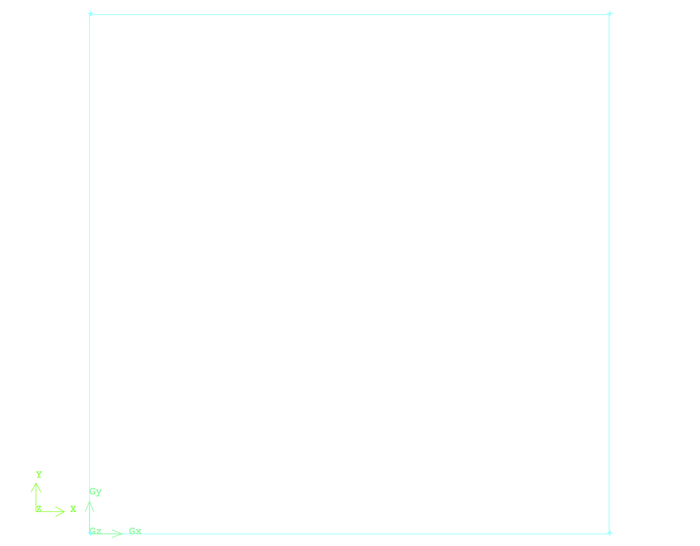
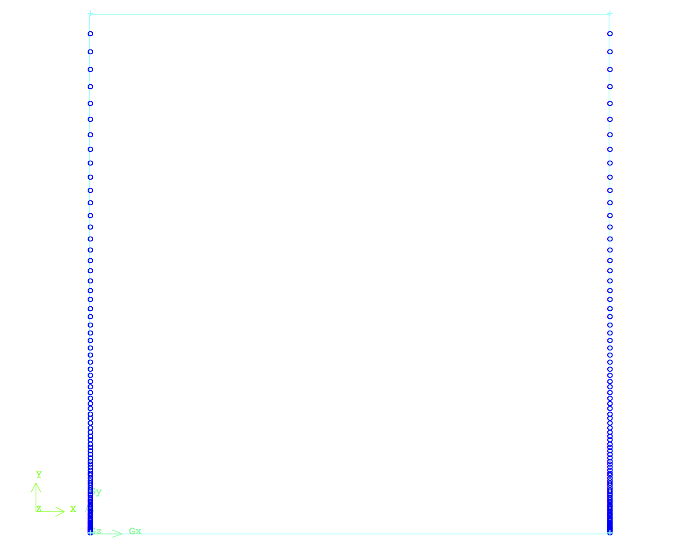
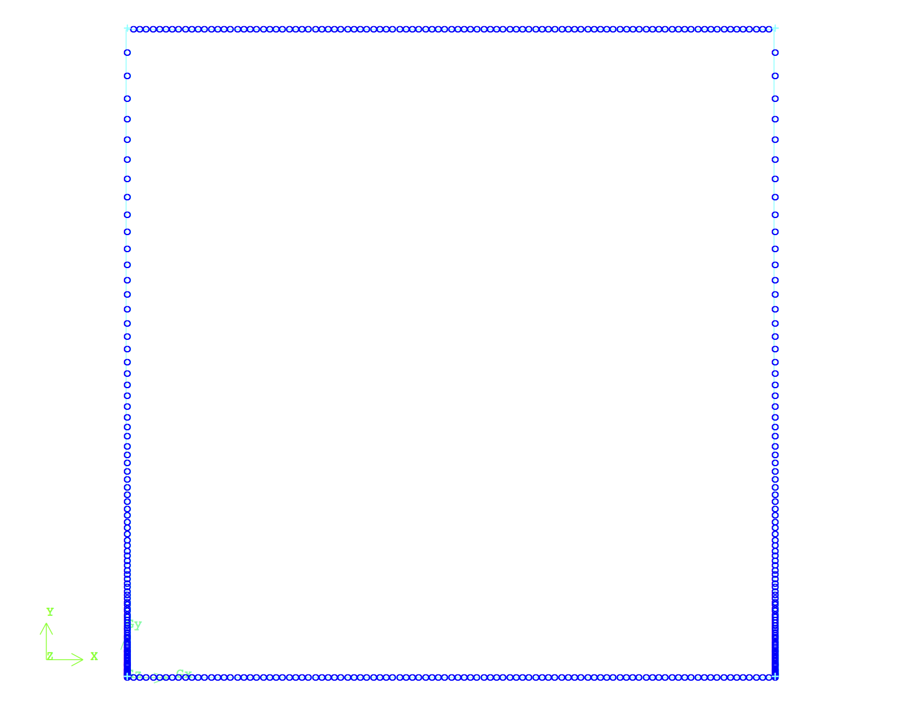
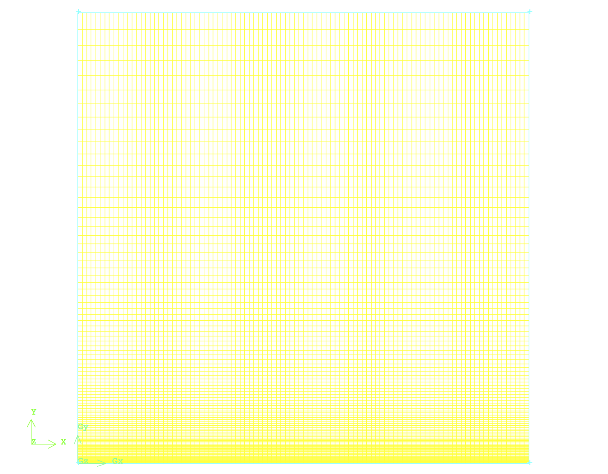

# CFD Domain's Creation & Discretization

**The next step for developing the CFD simulation for a case study, after the review of physics and theory behind the problem of interest, is to create the CFD/Computational domain. This CFD domain will first be created and then discretized into small finite elements (2D) or finite volumes (3D). The flow field's governing equations are then solved numerically inside these elements or volumes via an iterative process till a converged solution inside the CFD domain is obtained. This section explains the techniques and process of creation and discretization of the CFD domain for the problem of interest. It should be highlighted that this sections provides the most generic steps and techniques to create the CFD domain. Users can implement these steps/techniques in the mesher of their choice or Email teymourj@uw.edu to obtain the pre-generated mesh.**

The official mesh generator software/package for OpenFoam is called "blockMesh". blockMesh is a command base software. Users write/edit the desired settings to generate the CFD domain geometry and obtain the discretization process of choice in source file named "blockMeshDict" that ca be located at `\constant\polyMesh` the main directory of the CFD case study of interest. In simple words the "blockMeshDict" file is the dictionary, where the geometry of the CFD domain and it's discretization process are fully defined. The "blockMeshDict" file then is compiled via the command `blockMesh`, that will generate multiple required files, which include the details of the CFD domain for the use of OpenFoam solver in the same directory where the blockMeshDict file is located. Readers can read more about the blockMesh utility [here](http://cfd.direct/openfoam/user-guide/blockmesh/).

Alternatively, OpenFoam has various built-in commands, which allow it's users to convert their previously generated CFD domain into the readable format for the solver in OpenFoam. A list of these commands can be found [here](http://www.openfoam.org/features/mesh-conversion.php). In this tutorial this alternative approach is used to convert the previously generated CFD domain, in * .msh format, to the readable format for the solver in OpenFoam. In order to perform this process users put the * .msh file of the previously generated CFD domain in the main working directory and use the command `fluentMeshToFoam` with the name of the * .msh file after it to perform the mesh conversion process: `fluentMeshtoFoam <file name>.msh`. After running this command make sure that the generated report contains no error or problem. The details of the previously generated CFD domain in * .msh format are fully explained below.

The CFD domain for the 2D laminar flow over a flat plate is chosen to be a finite two dimensional square with sides of 1 [m] as shown in Fig.1. The shape and dimensions of the domain are chosen such that the required number of mesh elements can be controlled and non-dimensional groups of variables can be estimated fast, while most of variables are set to be equal unity. The users can define the dimensions of the CFD domain according to their own problem definition.

 
Fig.1 - The geometry of CFD domain for the two dimensional laminar flow over a flat plate.

To create the geometry of the visualized CFD domain in Fig.1, it is recommended to start with four points spaced equally with distance of 1 [m] with respect to each other. Then connect them together and define a unit, closed surface. This procedure might need to be implemented in a slightly different manner according to the used CAD/mesher software of choice.

After the CFD domain is created, it should be discretized into finite elements (a.k.a meshing procedure). In simple words, meshing is the process of "chopping" the geometry of the CFD domain into smaller finite elements and/or volumes, wherein the flow field's governing equations will be solved numerically. High quality mesh elements, with reasonable aspect ratio, would lead to a smoother and more promising numerical solution. Therefore, it is important to increase the quality and level of controllability in the CFD domain at the first step by proper meshing and topology techniques.

In the current problem of interest to increase the level of controllability on mesh resolution, the vertical edges of the CFD domain are discretized into 100 mesh elements starting with a first length of 1 [mm] from the bottom vertical edge. The mesh element distribution along these edges follow a predefined distribution as shown in Fig.2. The predefined distribution would control the mesh resolution along the edge from the bottom to top of the domain. The rule of thumb is to have a high mesh resolution mesh in the regions where the flow field behavior is complex and decrease it where the flow field behavior is simple. For very complex flow field such as turbulent boundary layer there are specific techniques and guidelines to set the mesh resolution, which will be discussed when necessary. Therefore, users need to provide a high mesh resolution close to flat plate boundary, where the physics of the flow are more complex (i.e. boundary layer region) and gradually decrease it to the top of the domain where flow field is uniform and simple.  This mesh technique provide users the capability to modify the mesh later for more complex flows with minimum amount of effort and time.

 
Fig.2 - Controlling mesh element distribution along the vertical edges of the CFD domain.

In the next step the horizontal edges of the CFD domain will be meshed. For these edges a uniform distribution of mesh elements along them are used as visualized in Fig.3. It should be noted that if required the users can define specific mesh element distribution to increase or decrease the mesh resolution at the inlet, middle or outlet of the domain. For the current problem of the interest this specific considerations are not necessary.

 
Fig.3 - Uniform mesh distribution along the horizontal edges of the CFD domain.

Finally the two dimensional CFD domain can be meshed using the proper meshing algorithm of choice via connecting the previously generated mesh elements to each other. Fig. 4 visualizes the outcome of this meshing progress. As shown in Fig.4 the mesh resolution is higher close to the boundary of the flat plat and it decreases moving up toward the top part of the CFD domain.

 
Fig.4 - Finalized mesh of the CFD domain.

Once the mesh is generated it's quality should be examined. This can be done using the provided features and functions defined in the meshing software. In general these functions calculate the aspect ratio of each elements and report a statistical report on them. The goal is to keep the average aspect ratio close to 1 for a very high quality mesh. In this stage the CFD domain is completely meshed and is ready to be setup for a CFD simulation.

<More explanations can be added here on the concept of mesh examination.>

<The complete mesh file (.msh) can be downloaded here [Download Mesh Here!](https://github.com/teymourj/2D-flow-over-flat-plate-laminar/blob/master/laminar_flatplate_flow.msh)>
