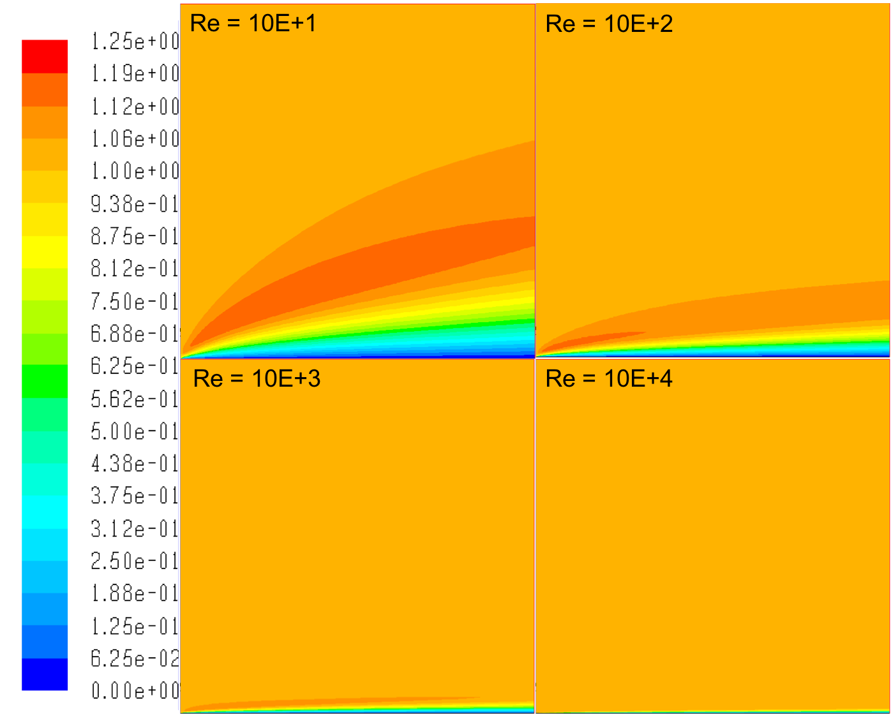

# CFD Results Post-Process

**The final step for the development of a CFD simulation for a problem of interest is to process and examine the validity of the obtained numerical results (a.k.a post-processing and validation step). This steps requires an in-depth engineering knowledge about the fundamentals of the physical problem of interest. Thus, the value of investing time in understanding the fundamental physics of the flow, once again is highlighted here. This process is done starting from general inspection on CFD simulation results and ends with more detail validation process.**

The first general rule of thumb to check the convergence of a CFD simulation is to check the residual values for key flow variables, such as mass, velocity and etc.. In OpenFoam the residual values from velocity components are printed out at every single iteration by default as shown below:

```C++
```
<Describe the presented summary above.>
Fig. 1 visualizes the residual values of continuity and streamwise velocity versus the number of iterations. The general decreasing trend of the residual values confirm that the numerical solution of the conservation/governing equations are converging to specific final values. Usually the residual for the continuity decreases with the slower rate compared to other residual values. Therefore, a continuity residual of 10E-3, is the first necessary, but not sufficient, general criteria to confirm the convergence of the CFD simulation. In this case problem (Re=100), this criteria is reached after about 35 iterations and after about 700 iterations the continuity residuals reached value of 10E-5, which is a solid confirmation of CFD simulation convergence.

The second step is to visualize dimensionless form of the important variables within the CFD domain. This visualization step can be problem specific and should be performed over an adequate plane of choice. In OpenFoam the post-processing is recommended to be done in ParaView, which is the recommanded post-processor package of OpenFoam. Running the command `paraFoam` in the terminal, while locating in the working directory of the simulation will simply load all the obtained numerical results and get it ready for post-processing.

For most of the problems contour of normalized velocity or pressure, over a horizontal or vertical plane at the center of the CFD domain, is a good start point. For the current problem, since the entire domain is two dimensional and planar, it would make the entire domain the best candidate for the post-processing plane.

User should now define the normalized variable of interest that needs to be visualized. The normalized streamwise velocity by the inlet velocity can be defined <discuss the steps to define variables in paraFoam>, name the variable (i.e. `Vx_over_V0`) and put the required formula for the variable of interest (i.e. `x_velocity/1`). This will calculate the normalized streamwise velocity with free stream velocity within entire CFD domain. At this stage users can select <discuss the steps> to visualize the velocity field.

Explain how the first view is `t=0` data and put the move of boundary layer formation here.


</br>
Fig.2 - Contours of normalized streamwise velocity with the free stream velocity over a flat plate for Reynolds numbers of 100.

<discuss visualized video here.>
Fig. 2 visualizes the normalized streamwise velocity with free stream for four different flows with various Reynolds numbers (specified on each contour). The general physics for all four flows are the same. Flow enters the domain with normalized velocity of 1. Due to the imposed no slip boundary conditions on the flat plate, the velocity instantly decrease to zero at edge of the plate and the boundary layer starts to form and grows moving further downstream the plate. Furthermore, Fig. 2 visualizes that by increasing the order of magnitude for the Reynolds number, increasing the effect of inertial forces over viscous forces, the thickness of boundary layer along the flat plate decreases. This agrees with the general physics of this flow field, which states the local laminar boundary layer thickness (**&delta;**) is proportional to the inverse square root of local Reynolds number. It should also be highlighted that these velocity contours are smooth. The smoothness confirms the validity of created mesh resolution and convergence of the numerical solution. However, this is only an additional necessary, but not sufficient criteria for simulation validity and convergence.

**After performing the general post-processing steps, the user need to perform more detail oriented post-processing to confirm the validity of the CFD simulation. This stage can be a state-of-the-art. Comparing the numerical results against the theory (discussed earlier) or any other available experimental results is the final stage of post-processing. It is extremely important to calculate the correct corresponding numerical variables and compare them against the experimental or other numerical data.**

For the problem of two dimensional laminar flow over a flat plate, users can visualize the variation of normalized streamwise velocity with the free stream (**V<sub>x**/**V<sub>0**) versus the similarity variable (**&eta;**). As discussed earlier in the physics section of this problem, if **V<sub>x**/**V<sub>0** is plotted versus non-dimensional similarity variable **&eta;**, instead of dimensional variables such as **u** and **y**, it should shows a universal curve for **any** Reynolds number and **any** position along the plate. Fig 3 visualizes the variation of **V<sub>x**/**V<sub>0** against **&eta;** for various Reynolds number at all point's within the CFD domain.


</br>
Fig.3 - Variation of normalized streamwise velocity against similarity variable for the flow over a flat plate for various Reynolds numbers.

Fig. 3 shows that the evolution of the velocity at any point with respect to the similarity variable is in a good agreement with the trend discussed in the physics section. The interesting observation here is that as the Reynolds number of the flow increases the plotted curve matches the expected experimental trend better. The reason behind this observation is that increase in Reynolds number order of magnitude lead to decrease of boundary layer thickness, which is one of the most fundamental assumption of Blasius solution. Therefore, the visualized trend for flow with Re=10E+4 shown in Fig. 4 is almost identical to the presented experimental results in physics section of this tutorial.


</br>
Fig.4 - Variation of normalized streamwise velocity against similarity variable for the flow over a flat plate for Reynolds numbers of 10E+4.

At this stage one can conclude that this CFD numerical simulation is validated to study laminar flow over a flat plate. For further validation one can visualize the variation of friction force/coefficient along the plate for different Reynolds number and compare the results against the corresponding theory. Therefore, it can be used for similar or more complex problems, such as flow with specified pressure gradient, non-uniform velocity profiles and etc.. This can be done via correct implementation in changing the corresponding boundary conditions.
