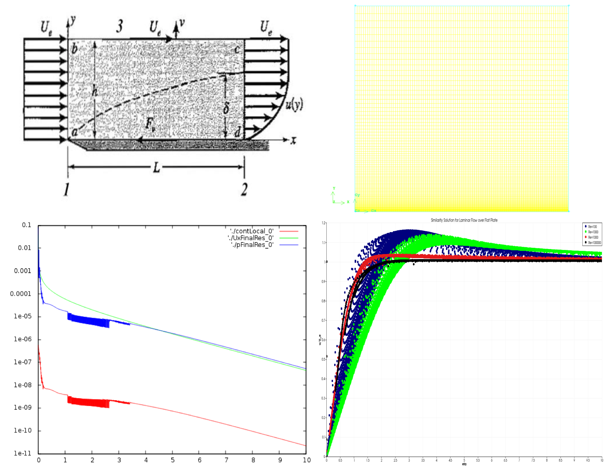

# OpenFoam
A general methodological/scientific approach to develop and process a CFD simulation in OpeanFoam for 2D laminar flow over a flat plate is explained and discussed here.

The four major steps to develop a CFD simulation case for any fluid mechanics consists the following four steps:

1. **[CFD Problem's Physics & Theory](https://github.com/teymourj/2D-flow-over-flat-plate-laminar/blob/master/Docs/Open_Foam/Physics.md)**

2. **[CFD Domain's Creation & Discretization](https://github.com/teymourj/2D-flow-over-flat-plate-laminar/blob/master/Docs/Open_Foam/Domain.md)**

3. **[CFD Simulation Case Setup](https://github.com/teymourj/2D-flow-over-flat-plate-laminar/blob/master/Docs/Open_Foam/Simulation.md)**

4. **[CFD Results Post-Process](https://github.com/teymourj/2D-flow-over-flat-plate-laminar/blob/master/Docs/Open_Foam/Post_Process.md)**

This wiki includes the explanation of the above-mentioned steps for the problem of Laminar Flow over a flat plate.
